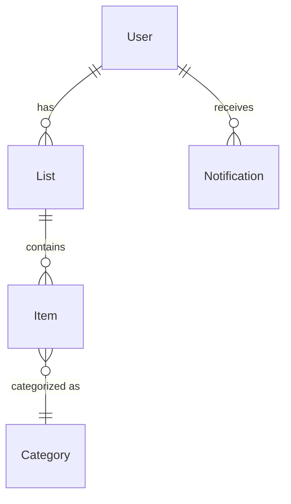

# Software Requirements Specification (SRS)

## Overview
This document outlines the functional and non-functional requirements for the collaborative shopping list application described in the [PRD](PRD.md). The goal is to provide a simple, cross-platform solution that keeps household members in sync about what to buy.

## Functional Requirements
1. **Real-time Synchronization** – list updates must propagate instantly across all connected devices.
2. **Item Categorization** – items can be grouped by aisle or section to aid navigation in-store.
3. **Notifications & Reminders** – users receive alerts when items are added and reminders when it's time to shop.
4. **Offline Support** – users may create or edit lists without a connection; changes synchronize when connectivity returns.
5. **Frequent Item Suggestions** – the system recommends commonly purchased items based on past entries.
6. **Cross-platform Access** – the application provides a consistent experience on web and mobile devices.
7. **Accessible Design** – the interface is easy for users of all ages and technical backgrounds.

## Non-Functional Requirements
- **Performance** – application should load within 2 seconds on modern devices and synchronize changes within 1 second when online.
- **Reliability** – data is persisted locally for offline use and synced reliably with the server when online.
- **Usability** – the interface follows accessibility guidelines (WCAG 2.1 AA) and is intuitive for non-technical users.
- **Security** – user data is transmitted over HTTPS and stored securely with proper authentication controls.
- **Scalability** – the backend should support growth in the number of households and list items without significant degradation.

## Data Model Overview


### Entity Descriptions
- **User** – account or profile representing a family member.
- **List** – shared shopping list for a household. Multiple lists per user are possible.
- **Item** – individual entry on a list with fields such as name, quantity and checked status.
- **Category** – aisle or section used to group items.
- **Notification** – reminder or alert about list updates or scheduled shopping times.

## API Endpoints (OpenAPI Draft)
```yaml
openapi: 3.1.0
info:
  title: Shopping List API
  version: '0.1.0'
paths:
  /users:
    post:
      summary: Create a new user
      requestBody:
        required: true
        content:
          application/json:
            schema:
              $ref: '#/components/schemas/User'
      responses:
        '201':
          description: User created
  /lists:
    get:
      summary: Retrieve all lists for the authenticated user
      responses:
        '200':
          description: A list of shopping lists
          content:
            application/json:
              schema:
                type: array
                items:
                  $ref: '#/components/schemas/List'
    post:
      summary: Create a new list
      requestBody:
        required: true
        content:
          application/json:
            schema:
              $ref: '#/components/schemas/List'
      responses:
        '201':
          description: List created
  /lists/{listId}:
    get:
      summary: Retrieve a specific list
      parameters:
        - in: path
          name: listId
          required: true
          schema:
            type: string
      responses:
        '200':
          description: The requested list
          content:
            application/json:
              schema:
                $ref: '#/components/schemas/List'
    put:
      summary: Update a list
      parameters:
        - in: path
          name: listId
          required: true
          schema:
            type: string
      requestBody:
        required: true
        content:
          application/json:
            schema:
              $ref: '#/components/schemas/List'
      responses:
        '200':
          description: List updated
    delete:
      summary: Delete a list
      parameters:
        - in: path
          name: listId
          required: true
          schema:
            type: string
      responses:
        '204':
          description: List deleted
  /lists/{listId}/items:
    get:
      summary: Retrieve items for a list
      parameters:
        - in: path
          name: listId
          required: true
          schema:
            type: string
      responses:
        '200':
          description: List items
          content:
            application/json:
              schema:
                type: array
                items:
                  $ref: '#/components/schemas/Item'
    post:
      summary: Add an item to a list
      parameters:
        - in: path
          name: listId
          required: true
          schema:
            type: string
      requestBody:
        required: true
        content:
          application/json:
            schema:
              $ref: '#/components/schemas/Item'
      responses:
        '201':
          description: Item added
  /lists/{listId}/items/{itemId}:
    put:
      summary: Update a list item
      parameters:
        - in: path
          name: listId
          required: true
          schema:
            type: string
        - in: path
          name: itemId
          required: true
          schema:
            type: string
      requestBody:
        required: true
        content:
          application/json:
            schema:
              $ref: '#/components/schemas/Item'
      responses:
        '200':
          description: Item updated
    delete:
      summary: Remove a list item
      parameters:
        - in: path
          name: listId
          required: true
          schema:
            type: string
        - in: path
          name: itemId
          required: true
          schema:
            type: string
      responses:
        '204':
          description: Item removed
components:
  schemas:
    User:
      type: object
      properties:
        id:
          type: string
        name:
          type: string
        email:
          type: string
          format: email
      required: [name, email]
    List:
      type: object
      properties:
        id:
          type: string
        name:
          type: string
        createdAt:
          type: string
          format: date-time
      required: [name]
    Item:
      type: object
      properties:
        id:
          type: string
        name:
          type: string
        quantity:
          type: integer
          minimum: 1
        categoryId:
          type: string
        completed:
          type: boolean
      required: [name, quantity]
```
