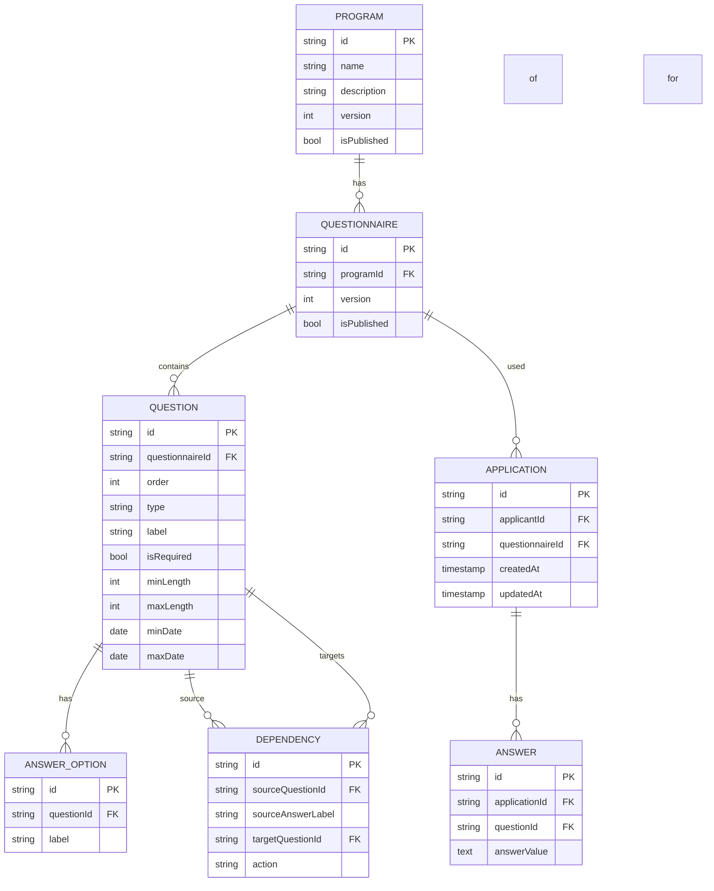

# Sephora Accelerate Questionnaire Platform  
**Software Requirements Specification (SRS)**  
_Version 1.0_  
**Date:** 2025-06-13  

---

## 1. Introduction

### 1.1 Purpose  
This document specifies the software requirements for the **Sephora Accelerate Questionnaire Platform**, supporting the Sephora Accelerate Program. The platform enables program administrators to design flexible application questionnaires and allows applicants to easily submit the required data.

### 1.2 Scope  
The platform will:
- Allow **Program Administrators** to create dynamic questionnaires.
- Enable **Applicants** to submit structured information through an intuitive interface.
- Support complex logic, validation, and version control.
- Provide a seamless and accessible experience across devices.

---

## 2. Functional Requirements

### 2.1 Administrator Functional Requirements  
- FR-ADM-1: Define and configure dynamic questionnaires.  
- FR-ADM-2: Add various input types: Short text, Long text, Single choice, Multiple choice, Date input, File upload, Video link.  
- FR-ADM-3: Set validation rules (required fields, length constraints, formats, file types, date ranges).  
- FR-ADM-4: Define dependencies between questions (show/hide based on responses).  
- FR-ADM-5: Manage versions of questionnaires with publishing workflow.  
- FR-ADM-6: Preview questionnaire in end-user mode.  

### 2.2 Applicant Functional Requirements  
- FR-APP-1: Easily navigate through the questionnaire.  
- FR-APP-2: Clearly see required vs optional questions.  
- FR-APP-3: Experience dynamic showing/hiding of questions.  
- FR-APP-4: Receive real-time validation feedback.  
- FR-APP-5: Upload files and video links.  
- FR-APP-6: Track application progress.  
- FR-APP-7: Save progress and return later.  

---

## 3. Non-Functional Requirements

### 3.1 Usability  
- UX must accommodate varying levels of digital literacy.
- Mobile-friendly responsive design.
- Accessible according to WCAG 2.1 AA.

### 3.2 Performance  
- Dynamic question updates should reflect in <200ms.
- Form autosave should occur without noticeable lag.

### 3.3 Reliability  
- Platform availability: 99.5% uptime.
- Data persistence guaranteed after each save point.

### 3.4 Security  
- All data encrypted at rest and in transit.
- Role-based access for administrators and applicants.

### 3.5 Scalability  
- Support for concurrent users applying during open cycles.

---

## 4. Data Model

### Entity Relationship (ER) Diagram (Mermaid format)



---

## 5. API Interface (OpenAPI Spec - Draft)

```yaml
openapi: 3.0.3
info:
  title: Sephora Accelerate Questionnaire API
  version: 1.0.0
  description: API for managing dynamic questionnaires and applicant submissions.

paths:
  /programs/{programId}/questionnaires:
    get:
      summary: Get published questionnaire for a program
      parameters:
        - in: path
          name: programId
          required: true
          schema:
            type: string
      responses:
        '200':
          description: Questionnaire retrieved successfully

  /applications:
    post:
      summary: Submit application
      requestBody:
        required: true
        content:
          application/json:
            schema:
              type: object
              properties:
                applicantId:
                  type: string
                questionnaireId:
                  type: string
                answers:
                  type: array
                  items:
                    type: object
                    properties:
                      questionId:
                        type: string
                      answerValue:
                        type: string
      responses:
        '201':
          description: Application submitted successfully

  /applications/{applicationId}:
    patch:
      summary: Save partial application progress
      parameters:
        - in: path
          name: applicationId
          required: true
          schema:
            type: string
      requestBody:
        required: true
        content:
          application/json:
            schema:
              type: object
              properties:
                answers:
                  type: array
                  items:
                    type: object
                    properties:
                      questionId:
                        type: string
                      answerValue:
                        type: string
      responses:
        '200':
          description: Progress saved successfully
```

