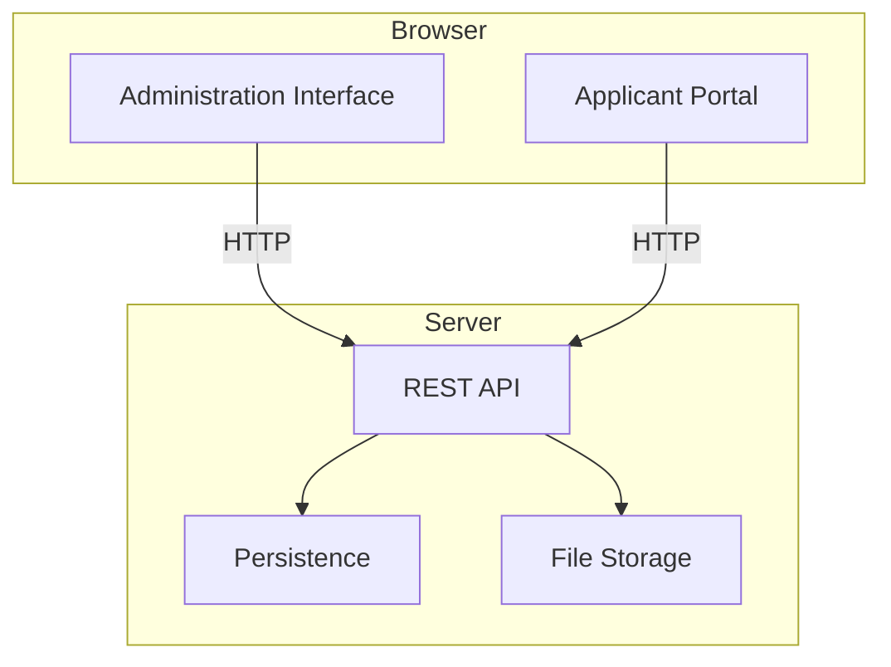

# System Architecture Overview

This document outlines the high-level architecture for the **Sephora Accelerate Questionnaire Project** as defined in the [Software Requirements Specification](./srs.md).

## Key Components

### Frontend
- Built with **Angular 20** using a standalone, signals-first approach.
- Provides two interfaces:
  - **Administration Interface** for creating and managing questionnaires.
  - **Applicant Portal** for completing questionnaires.
- Communicates with the backend via RESTful API calls.

### Backend
- Exposes a simple **REST API** to manage questionnaires and record responses.
- Implements endpoints such as `/questionnaires` and `/responses`.
- Handles basic validation and persistence (in-memory or lightweight storage).
- No authentication is required for the initial scope.

### Services / Persistence
- Stores questionnaire definitions and applicant responses.
- Supports file uploads when a question type requires an attachment.

## Relationships and Flows
1. **Administrators** use the Administration Interface to create and edit questionnaires. Changes are sent to the backend API and persisted.
2. **Applicants** access the Applicant Portal to retrieve a questionnaire. The frontend requests data from the backend and renders each question with validation rules.
3. When an applicant submits responses, the frontend sends them to the backend via the `/responses` endpoint. The backend validates and stores the data.

## Architecture Diagram

