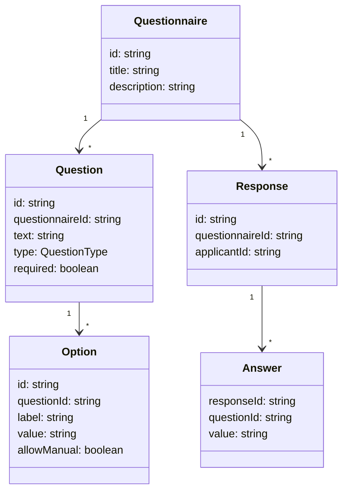

# Software Requirements Specification (SRS)

## Introduction
This document defines the requirements for the **Sephora Accelerate Questionnaire Project**. The project consists of an administration interface for creating questionnaires and an applicant portal for completing them.

## Functional Requirements
- Administrators can create, edit, and delete questionnaires.
- Each questionnaire supports multiple questions.
- Questions may be marked as mandatory or optional and the system enforces completion of required questions.
- Conditional logic allows questions to appear or hide based on answers to prior questions.
- Supported input control types:
  - Short text
  - Long text
  - Multiple choice
  - Single choice
  - Date input
  - File upload
  - Video link
- Administrators can configure constraints such as length limits, minimum selections, and file restrictions.
- Choice questions may allow manual entry of additional answers.
- Applicants can complete published questionnaires with validation and dependency logic applied.

## Non‑Functional Requirements
- Responsive interface usable on desktop and mobile browsers.
- Form validation should provide clear error messages and prevent invalid submissions.
- Basic persistence of questionnaires and responses (in-memory or simple storage) without full backend integration.
- Accessible design following common ARIA guidelines.
- The system is intended for a single-language environment and does not include user authentication.

## Data Model Overview


## API Endpoints (OpenAPI Draft)
```yaml
openapi: 3.0.0
info:
  title: Sephora Accelerate Questionnaire API
  version: 0.1.0
paths:
  /questionnaires:
    get:
      summary: List questionnaires
      responses:
        "200":
          description: List of questionnaires
          content:
            application/json:
              schema:
                type: array
                items:
                  $ref: '#/components/schemas/Questionnaire'
    post:
      summary: Create questionnaire
      requestBody:
        required: true
        content:
          application/json:
            schema:
              $ref: '#/components/schemas/Questionnaire'
      responses:
        "201":
          description: Created
  /questionnaires/{id}:
    get:
      summary: Get questionnaire by ID
      parameters:
        - in: path
          name: id
          required: true
          schema:
            type: string
      responses:
        "200":
          description: Questionnaire
          content:
            application/json:
              schema:
                $ref: '#/components/schemas/Questionnaire'
    put:
      summary: Update questionnaire
      parameters:
        - in: path
          name: id
          required: true
          schema:
            type: string
      requestBody:
        required: true
        content:
          application/json:
            schema:
              $ref: '#/components/schemas/Questionnaire'
      responses:
        "200":
          description: Updated
    delete:
      summary: Delete questionnaire
      parameters:
        - in: path
          name: id
          required: true
          schema:
            type: string
      responses:
        "204":
          description: Deleted
  /responses:
    post:
      summary: Submit applicant responses
      requestBody:
        required: true
        content:
          application/json:
            schema:
              $ref: '#/components/schemas/QuestionnaireResponse'
      responses:
        "201":
          description: Recorded
components:
  schemas:
    Questionnaire:
      type: object
      properties:
        id:
          type: string
        title:
          type: string
        description:
          type: string
        questions:
          type: array
          items:
            $ref: '#/components/schemas/Question'
    Question:
      type: object
      properties:
        id:
          type: string
        text:
          type: string
        type:
          type: string
          enum:
            - shortText
            - longText
            - multipleChoice
            - singleChoice
            - date
            - file
            - videoLink
        required:
          type: boolean
        options:
          type: array
          items:
            $ref: '#/components/schemas/Option'
    Option:
      type: object
      properties:
        id:
          type: string
        label:
          type: string
        value:
          type: string
        allowManual:
          type: boolean
    QuestionnaireResponse:
      type: object
      properties:
        questionnaireId:
          type: string
        answers:
          type: array
          items:
            $ref: '#/components/schemas/Answer'
    Answer:
      type: object
      properties:
        questionId:
          type: string
        value:
          type: string
```
